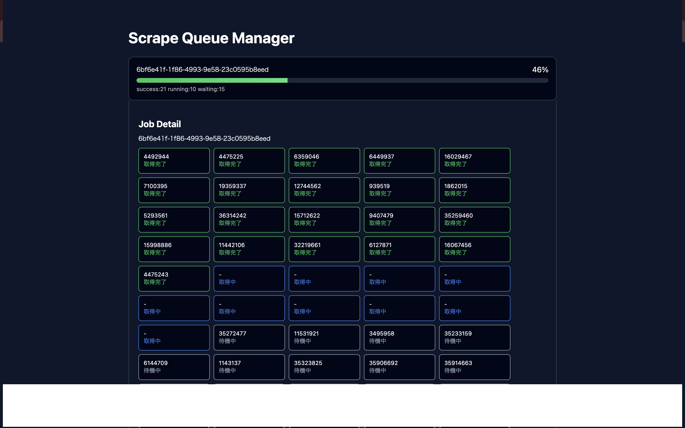

# Scrape Queue Manager UI

<p style="height:350px">

</p>

[discogs-price-helperのバックエンド側](https://github.com/benjaaamin0518/discogs-price-extension-backend)で行うスクレイピングジョブの状態をリアルタイムで監視するための
**React製ダッシュボードUI**です。

バックエンドの `ScrapeQueue` クラスが持つ `jobInfos` の状態をAPI経由で取得し、
ジョブの進行状況・タスクの状態を視覚的に確認できます。

---

## Features

- 📊 **ジョブ進行状況表示**
- 📦 **Jobごとのタスク状態一覧**
- 🔄 **自動ポーリング更新**
- 🎯 **クリックしたJobのみ詳細展開**
- 📈 **進行率プログレスバー**
- 🎨 **statusごとの色分け表示**

---

## UI Overview

### Job List

各ジョブの進行状況を一覧で表示します。

```
Job
────────────────────────
6fe6973f...  ███████░░░ 70%
success:46 running:10 waiting:20

e9ef6d8b...  ███░░░░░░░ 30%
success:12 running:8 waiting:32
```

---

### Job Detail

Jobをクリックすると、そのJobの下に詳細が展開されます。

```
Job Detail
────────────────────────

JobID
6fe6973f-2f21-473f-9b63

Tasks

[16029467]  完了
[19359337]  完了
[3495958 ]  取得中
[15712622]  待機中
```

---

## Tech Stack

- React
- Vite
- TanStack React Query
- CSS (inline style)

---

## Installation

```bash
git clone discogs-price-extension-queue-manager

cd discogs-price-extension-queue-manager

npm install
```

---

## Run

```bash
npm run dev
```

ブラウザで開く

```
http://localhost:5173
```

---

## API

フロントエンドは以下のAPIを呼び出します。

```
POST /api/v1/jobInfos
```

### Response Example

```json
{
  "status": 200,
  "result": [
    {
      "jobId": "6fe6973f-2f21-473f",
      "jobStatus": [
        {
          "resourceId": "16029467",
          "label": "取得完了"
        },
        {
          "resourceId": "3495958",
          "label": "取得中"
        }
      ]
    }
  ]
}
```

---

## Frontend Structure

```
src
 ├ components
 │  ├ JobList.jsx
 │  ├ JobRow.jsx
 │  ├ JobDetail.jsx
 │  └ ProgressBar.jsx
 │
 ├ hooks
 │  └ useQueue.js
 │
 ├ pages
 │  └ Dashboard.jsx
 │
 └ App.jsx
```

---

## Data Flow

```
API
 ↓
useQueue (React Query)
 ↓
Dashboard
 ↓
JobList
 ↓
JobRow
 ↓
JobDetail
```

---

## Auto Refresh

ジョブの状態は **2秒ごとに自動更新**されます。

```javascript
refetchInterval: 2000;
```

---

## Job Status Color

| Status   | Color |
| -------- | ----- |
| 取得完了 | Green |
| 取得中   | Blue  |
| 待機中   | Gray  |

---

## Future Improvements

- WebSocketによるリアルタイム更新
- Worker状態モニタリング
- 処理速度グラフ
- エラー率表示
- Job retry機能
- ログストリーム表示

---
